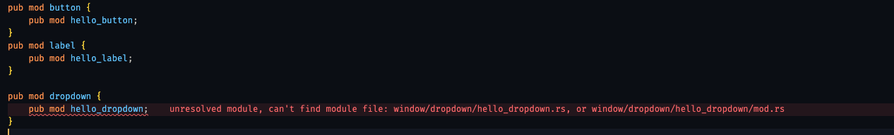
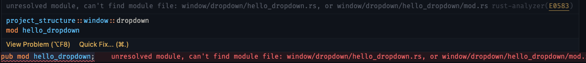
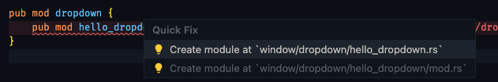
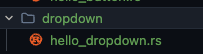

## Estructura de proyecto

Este proyecto tiene solo como objetivo dar a entender como se puede estructurar un proyecto en Rust y que permita crecer y que sea escalable.
Solo es con fines educativos, dado que a veces se tiene la confusión de utilizar multiples archivos mod.rs o solo un archivo lib.rs donde se agrupen los diferentes modulos del proyecto.

Es importante tener en cuenta que si estas usando vs code como tu editor de codigo, te recomiendo iniciar definiendo los modulos en el archivo lib.rs,
esto se debe porque lo más probable es que estes usando la extensión Rust-Analyzer y al crear a veces los archivos directamente y luego lo llevas a lib.rs, se te puede llegar a presentar el siguiente mensaje

```plaintext
This file is not included in any crates, so rust-analyzer can't offer IDE services.

If you're intentionally working on unowned files, you can silence this warning by adding "unlinked-file" to rust-analyzer.diagnostics.disabled in your settings.
```

En cambio si primero lo generas desde un archivo lib.rs o como esta en la estructura del proyecto window.rs, te ayudará a crear una estructura correcta. Esto se muestra a continuación:

Aquí definimos el modulo. En este punto la estructura aún no esta creada.



Lo más probable es que nos aparezca este error:



Damos clic sobre "Quick Fix", y nos aparecerá dicha opción, en cuyo caso daremos clic sobre la primera opción:



Al realizar el paso anterior, veremos en la estructura del proyecto que se ha creado correctamente la carpeta y el archivo "\*.rs" del modulo.


